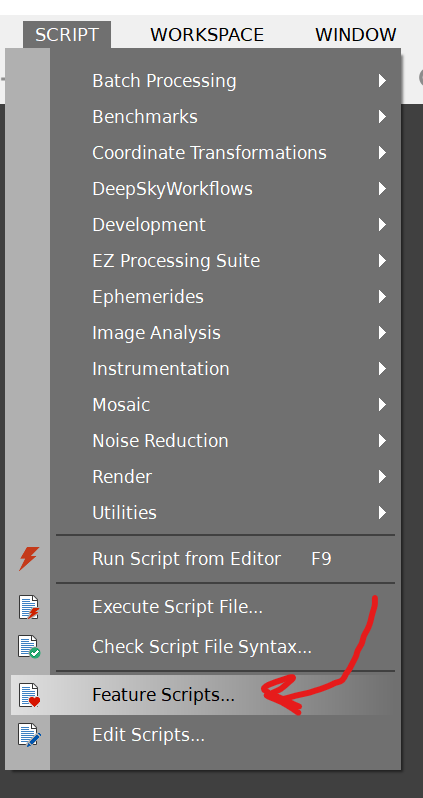
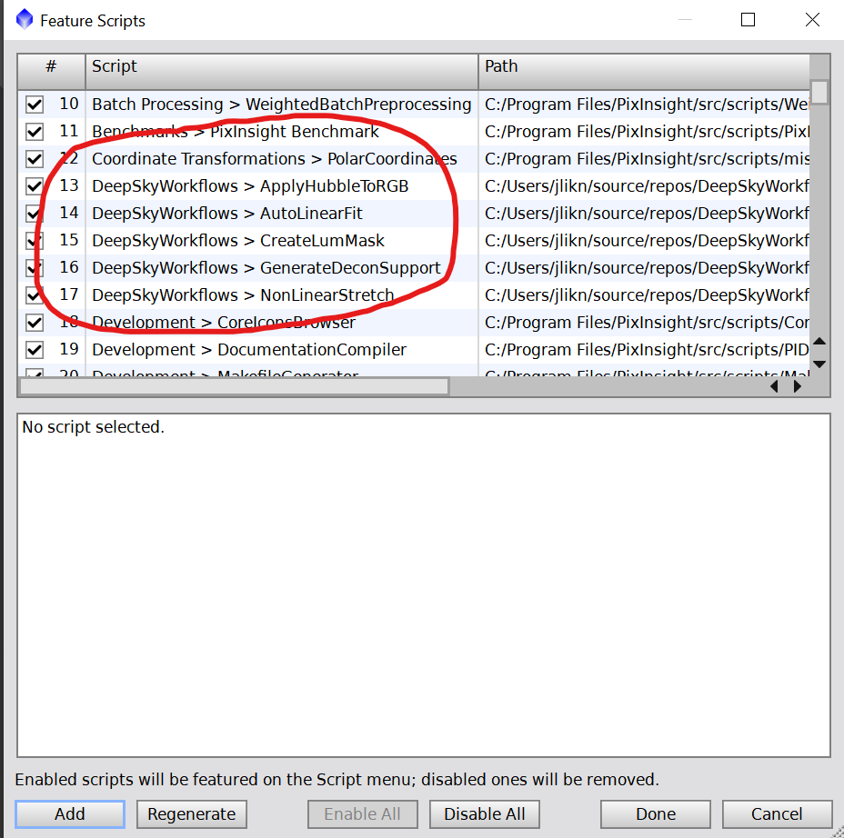

# PixInsight Scripts

This folder contains various script to assist with workflows.

## Scripts

These are the active scripts. I have available to date.

- [Auto-Linear Fit](./docs/autoLinearFit.md) is a script for normalizing RGB channels.
- [Create Lum Mask](./docs/createLumMask.md) is a quick way to generate a luminance mask from a non-linear image.
- [Non-Linear Stretch](./docs/nonLinearStretch.md) can help boost the brightness of your targets while diminishing the background.
- [Generate Decon Support](./docs/generateDeconSupport.md) creates the masks I use for deconvolution.

## Installation

The first step is to download the scripts. You can either clone this repository, or [download the zip](./piscripts.zip).

Once you have the scripts in a folder, for example, `DeepSkyWorkflows`, you can install with the following steps:

1. Open PixInsight
2. Under the `Scripts` tab, choose `Feature Scripts`
   
3. With the dialog that opens, click the `Add` button in the lower left
4. Navigate to and select the folder with the scripts
5. Verify that `DeepSkyWorkflows` has been added
   
6. You're ready to go! It should appear under `Scripts > DeepSkyWorkflows`.

[Back to Main](../README.md)
